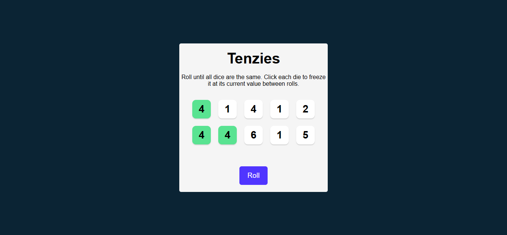
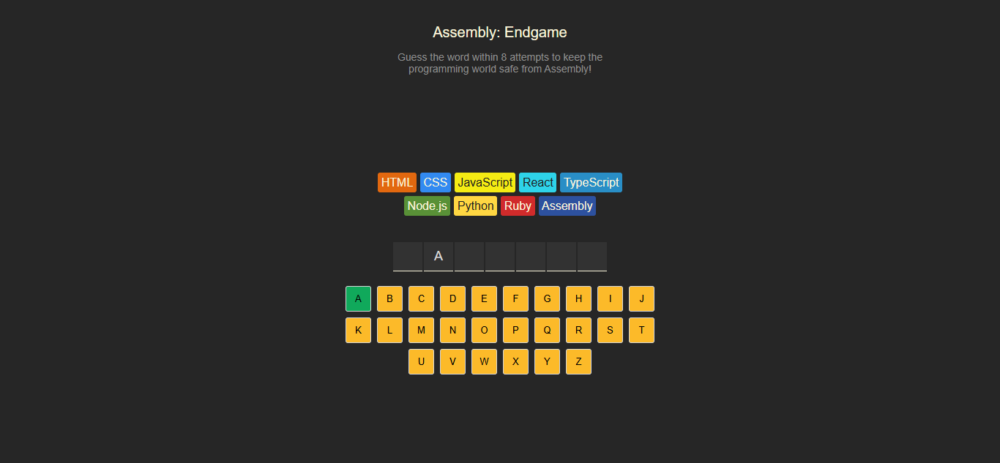

# 🎯 Learn TypeScript - Course Projects

This repository contains practical TypeScript projects built as part of the **[Learn TypeScript Course](https://scrimba.com/learn-typescript-c03c)** from Scrimba. The course introduces essential TypeScript concepts through hands-on development and building interactive games.

## 📚 Course Overview

The course covers TypeScript fundamentals through practical application, exploring the essential building blocks of TypeScript's type system to write safer and more maintainable code.

### Topics Covered

1. **Basic Types** - Understanding TypeScript's fundamental type system
2. **Literal Types** - Working with specific, constrained values
3. **Custom Types (Objects)** - Defining and using custom data structures
4. **Typed Arrays** - Type annotations for arrays and collections
5. **Optional Properties** - Handling optional object properties
6. **Unions** - Working with multiple possible types
7. **Type Narrowing** - Safely handling different value types
8. **Utility Types** - Leveraging Partial, Omit, and other utility types
9. **Generics** - Writing reusable, type-safe code

### Learning Objectives

By completing this course, you will be able to:

- ✅ Understand TypeScript's type system fundamentals
- ✅ Add type annotations to variables and custom types
- ✅ Define custom types for accurate data representation
- ✅ Apply type annotations to arrays and nested objects
- ✅ Use literal and union types for constrained value sets
- ✅ Implement type narrowing for explicit and safe type handling
- ✅ Define function return types including `void`
- ✅ Leverage TypeScript-specific types like `any` and utility types
- ✅ Design and use generic functions for reusable code
- ✅ Fix TypeScript warnings through proper typing

## 🎮 Projects

This repository contains two interactive React + TypeScript games that demonstrate the concepts learned throughout the course:

### 1. 🎲 Tenzies - Dice Rolling Game

A fun dice game where players roll dice until all show the same number. Click dice to "hold" them between rolls.



**Key TypeScript Features Demonstrated:**

- Custom type definitions for game state
- Typed arrays and object manipulation
- Function type annotations
- State management with TypeScript
- Event handler typing

**Technologies Used:**

- React 19
- TypeScript
- Vite
- React Confetti
- Nanoid

[View Project →](./tenzies/)

### 2. 🔤 Word Guessing Game

An engaging word guessing game where players guess letters to reveal a hidden programming-related word. Incorrect guesses eliminate programming languages one by one.



**Key TypeScript Features Demonstrated:**

- Complex custom types and interfaces
- Union types and type narrowing
- Utility types (Partial, Omit)
- Generic functions
- Advanced state management typing
- Component prop typing

**Technologies Used:**

- React 19
- TypeScript
- Vite
- React Confetti
- CLSX (conditional styling)

[View Project →](./word-guessing-game/)

## 🚀 Getting Started

### Prerequisites

- Node.js (v18 or higher)
- pnpm (recommended) or npm

### Installation & Running

1. **Clone the repository**

   ```bash
   git clone https://github.com/KhaledSaeed18/scrimba-typescript-course.git
   cd scrimba-typescript-course
   ```

2. **Run Tenzies Game**

   ```bash
   cd tenzies
   pnpm install
   pnpm dev
   ```

3. **Run Word Guessing Game**

   ```bash
   cd word-guessing-game
   pnpm install
   pnpm dev
   ```

### Building for Production

For either project:

```bash
pnpm build
pnpm preview
```

## 🛠️ Development

Both projects are built with:

- **React 19** - Latest React with modern features
- **TypeScript** - Type-safe JavaScript development
- **Vite** - Fast build tool and development server
- **ESLint** - Code linting and quality assurance

### Project Structure

```text
scrimba-typescript-course/
├── demo-images/          # Project demonstration images
├── tenzies/             # Dice rolling game
│   ├── src/
│   │   ├── components/
│   │   └── App.tsx
│   └── package.json
├── word-guessing-game/  # Word guessing game
│   ├── src/
│   │   ├── components/
│   │   ├── languages.ts
│   │   ├── words.ts
│   │   └── App.tsx
│   └── package.json
└── README.md
```

## 🎯 TypeScript Concepts in Action

### Custom Types & Interfaces

```typescript
type Die = {
  value: number
  isHeld: boolean
  id: string
}

type Language = {
  name: string
  backgroundColor: string
  color: string
}
```

### Function Type Annotations

```typescript
function generateAllNewDice(): Die[] {
  return new Array(10)
    .fill(0)
    .map(() => ({
      value: Math.ceil(Math.random() * 6),
      isHeld: false,
      id: nanoid()
    }))
}
```

### Type Narrowing & Guards

```typescript
const isGameWon: boolean = 
  currentWord.split("").every((letter: string): boolean => 
    guessedLetters.includes(letter)
  )
```

## 📖 Course Resources

- **Course Link:** [Learn TypeScript - Scrimba](https://scrimba.com/learn-typescript-c03c)
